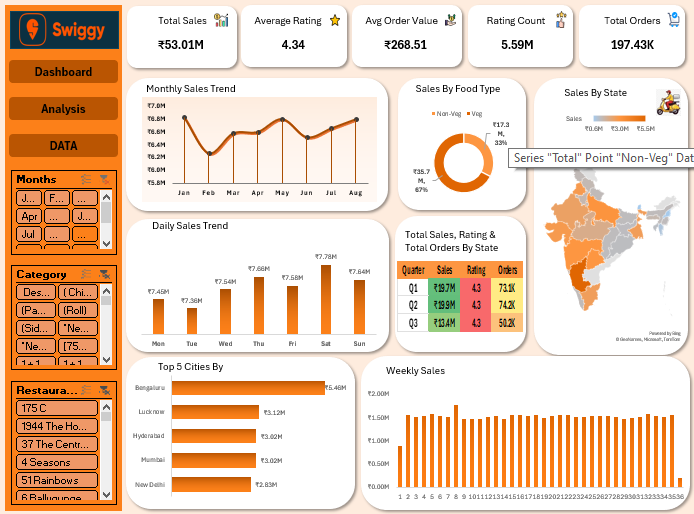

# Swiggy Sales Analysis Dashboard

## 📊 Project Overview
This project presents an interactive Swiggy Sales Analytics Dashboard created using Microsoft Excel.
The dashboard analyzes sales performance, orders, ratings, food categories, states, cities, and sales trends to provide meaningful business insights.

## 🎯 Project Objective
The main objective of this project is to analyze Swiggy sales data and create an interactive dashboard that helps understand:
- Overall sales performance
- Average customer rating
- Average order value
- Total number of orders
- Monthly sales trends
- Daily sales trends
- Weekly sales performance
- Sales by food type
- Sales by state
- Sales by city
- Sales, ratings, and orders by quarter

## 🛠️ Tools Used
- Microsoft Excel
- Pivot Tables
- Pivot Charts
- Slicers
- Excel Formulas
- Data Cleaning
- Data Analysis
- Data Visualization

## 📈 Dashboard KPIs
The dashboard includes the following key performance indicators:
- Total Sales
- Average Rating
- Average Order Value
- Rating Count
- Total Orders

## 📊 Dashboard Analysis
The dashboard contains several visualizations:
### Monthly Sales Trend
Shows how sales change from month to month.
### Daily Sales Trend
Shows sales performance across different days of the week.
### Sales by Food Type
Compares sales between vegetarian and non-vegetarian food categories.
### Sales by State
Displays geographical sales distribution across Indian states.
### Top Cities by Sales
Highlights cities with higher sales performance.
### Weekly Sales
Shows sales distribution across different weeks.
### Quarterly Performance
Compares sales, ratings, and orders by quarter.

## 🔍 Key Dashboard Metrics
According to the dashboard:
- Total Sales: ₹53.01M
- Average Rating: 4.34
- Average Order Value: ₹268.51
- Rating Count: 5.59M
- Total Orders: 197.43K

## 💡 Business Insights
The dashboard can be used to identify:
- Sales trends over time
- High-performing cities
- Regional sales performance
- Customer rating patterns
- Order volume trends
- Food category performance
- Weekly and monthly sales fluctuations
- ## 📊 Swiggy Dashboard Preview

- ## 👨‍💻 Author
**Wilson Das**

